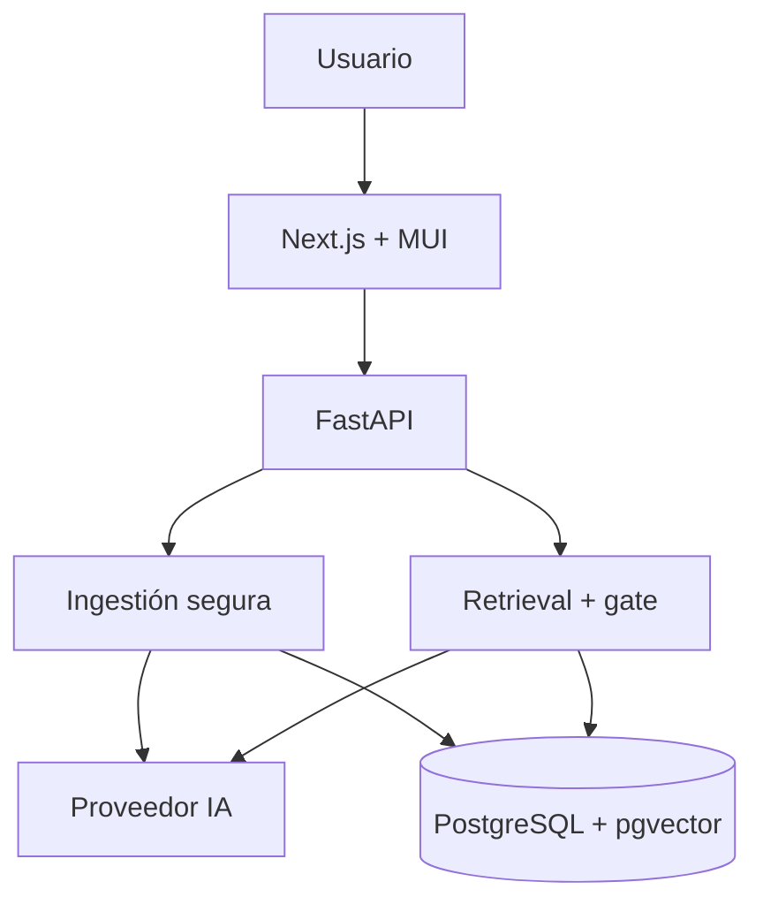

# EvidenceRAG

Asistente documental RAG verificable para portafolio profesional: carga PDF/TXT/MD, recupera evidencia semántica, responde solo cuando existe respaldo y muestra documento, página o sección y fragmento de cada fuente.

> El objetivo no es demostrar una investigación académica, sino capacidad senior para diseñar, implementar, medir, asegurar y desplegar una solución de IA aplicada.

La demo inicial consulta la [Memoria Integrada Los Héroes 2025](https://porpub2.storage.googleapis.com/wp-content/uploads/2026/05/20152448/Memoria-LH_2025_8M-Oficial.pdf), una fuente institucional pública. EvidenceRAG sigue siendo una solución genérica y no usa logotipos, identidad visual ni datos privados de la organización.

> **Demostración conceptual no oficial construida exclusivamente con información pública. No corresponde a un producto ni implementación de Caja Los Héroes.**

## Demo pública

- Aplicación: [https://rag.citec.cl](https://rag.citec.cl)
- Health API: [https://rag-api.citec.cl/health](https://rag-api.citec.cl/health)

El despliegue público usa el proveedor mock determinístico y exclusivamente el
corpus institucional público. HTTPS, CORS, health, citas, rechazo sin evidencia
y la evaluación live están verificados en `evals/results/deployment-mock.md`.

## Qué demuestra

- Ingestión segura con validación, SHA-256 e idempotencia.
- Extracción por página/sección y chunking configurable.
- PostgreSQL 16 + pgvector en producción; SQLite persistente para desarrollo.
- Abstracción de proveedor: OpenAI o modo mock determinístico.
- Retrieval híbrido vectorial/léxico con `top_k`, cobertura de términos, alcance nominal y gate mínimo de evidencia.
- Respuestas con citas controladas por la aplicación.
- Rechazo explícito de consultas sin respaldo o manifiestamente ambiguas.
- Request ID, logs JSON, latencias, tokens y costo configurable.
- Historial básico por sesión.
- Dataset sintético de 18 preguntas y evaluación live de 10 casos sobre el PDF público.
- UI Next.js + TypeScript + Material UI y despliegue Docker Compose.

## Recorrido rápido con Docker

Requisitos: Docker Engine y Compose v2.

1. Copie la configuración:

   ```bash
   cp .env.example .env
   ```

2. Reemplace `change-me-before-deploying` por una contraseña local segura en `POSTGRES_PASSWORD` y `DATABASE_URL`.

3. Levante el perfil local, enlazado únicamente a loopback:

   ```bash
   docker compose -f compose.yaml -f compose.local.yaml up --build
   ```

4. Abra:

   - Aplicación: `http://localhost:3000`
   - Swagger: `http://localhost:8000/docs`
   - Health: `http://localhost:8000/health`

5. Indexe el corpus público oficial; el cargador valida tamaño y SHA-256 y es idempotente:

   ```bash
   make seed-public
   ```

6. Abra la web y pruebe una pregunta sugerida. La consulta “¿Qué servicios ofrece específicamente Los Héroes Digital?” debe rechazarse porque el corpus no contiene una descripción oficial suficiente.

Los volúmenes `postgres_data` y `upload_data` mantienen información después de reiniciar servicios. El archivo base no publica puertos; `compose.local.yaml` agrega solamente `127.0.0.1:3000` y `127.0.0.1:8000`. Producción usa `compose.prod.yaml` y la red externa configurada en `PROXY_NETWORK`.

## Ejecución local sin Docker ni API key

Backend:

```bash
python3 -m venv .venv
.venv/bin/python3 -m pip install -e 'apps/api[dev]'
DATABASE_URL=sqlite:///./evidence_rag.db \
UPLOAD_DIR=./uploads \
AI_PROVIDER=mock \
.venv/bin/python3 -m uvicorn app.main:app --app-dir apps/api --reload
```

Frontend, en otra terminal:

```bash
cd apps/web
pnpm install
NEXT_PUBLIC_API_URL=http://localhost:8000/api/v1 pnpm dev
```

El modo mock no llama servicios externos. Produce embeddings sparse-hash normalizados y respuestas extractivas determinísticas; permite demostrar integración y ejecutar tests, pero no sustituye una evaluación de calidad generativa.

## Activar OpenAI

Configure únicamente en `.env` o en secrets del servidor:

```dotenv
AI_PROVIDER=openai
OPENAI_API_KEY=su-clave-local
OPENAI_EMBEDDING_MODEL=text-embedding-3-small
OPENAI_CHAT_MODEL=gpt-5-mini
EMBEDDING_DIMENSIONS=1536
```

No pegue la clave en chats, commits o capturas. La implementación usa `client.embeddings.create(...)` y `client.responses.create(...)`, siguiendo la [referencia de embeddings](https://developers.openai.com/api/reference/resources/embeddings/methods/create) y la [guía oficial de generación de texto con Responses API](https://developers.openai.com/api/docs/guides/text).

Si cambia proveedor o modelo manteniendo la dimensión, reingiera el corpus bajo la nueva huella. Si cambia la dimensionalidad, use una base nueva o una migración controlada porque la columna pgvector tiene dimensión fija. Configure las tres tarifas `OPENAI_*_USD_PER_MILLION` con los valores vigentes para habilitar el costo estimado; cero significa “no disponible”, no costo cero.

Cada índice queda identificado por proveedor, modelo y dimensión. Al cambiar de mock a OpenAI, ejecute nuevamente `make prod-seed-public`: el mismo PDF se vectoriza para el proveedor activo, y retrieval/listado ignoran automáticamente los vectores incompatibles del índice anterior.

## Arquitectura



La explicación completa está en [docs/architecture/overview.md](docs/architecture/overview.md). La integración MUI usa App Router y cache provider de acuerdo con la [guía oficial de Material UI para Next.js](https://mui.com/material-ui/integrations/nextjs/).

## API principal

| Método | Ruta | Propósito |
| --- | --- | --- |
| `GET` | `/health` | Salud de API, base y proveedor |
| `GET` | `/api/v1/config` | Configuración pública de UI |
| `POST` | `/api/v1/documents` | Ingerir PDF/TXT/MD multipart |
| `GET` | `/api/v1/documents` | Listar documentos y estados |
| `POST` | `/api/v1/query` | Consultar con `question`, `top_k`, `session_id` opcional |
| `GET` | `/api/v1/sessions/{id}/history` | Historial básico de una sesión |

Ejemplo de respuesta:

```json
{
  "answer": "Su meta es instalar 120 kilovatios antes del 31 de diciembre de 2027.",
  "evidence_sufficient": true,
  "citations": [
    {
      "id": "E1",
      "document": "programa_solar_andino.txt",
      "page": null,
      "section": "Resumen ejecutivo",
      "score": 0.61,
      "snippet": "El Programa Solar Andino..."
    }
  ],
  "metrics": {
    "retrieval_ms": 4.2,
    "generation_ms": 1.1,
    "total_ms": 6.0,
    "embedding_tokens": 12,
    "input_tokens": 410,
    "output_tokens": 28,
    "estimated_cost_usd": null
  }
}
```

## Evaluación

Ejecute:

```bash
.venv/bin/python3 scripts/run_evals.py
```

El script crea una base temporal, ingiere los tres documentos y regenera `evals/results/latest.json` y `latest.md`. El baseline mock de 2026-08-18 obtuvo:

| Métrica | Resultado |
| --- | ---: |
| Recall de documentos esperados @5 | 100% |
| Precisión de cita Top‑1 | 100% |
| Cobertura media de términos | 100% |
| Aceptación de respondibles | 100% |
| Rechazo de ambiguas/sin evidencia | 100% |
| Latencia mediana local | 4,03 ms |

Estas cifras corresponden solo al corpus sintético controlado y al proveedor determinístico. No deben presentarse como precisión general ni como resultado OpenAI. Consulte el [reporte generado](evals/results/latest.md).

Después de indexar la fuente institucional, evalúe la instancia real:

```bash
python3 scripts/run_live_evals.py \
  --api-url http://localhost:8000/api/v1 \
  --output-prefix evals/results/los_heroes_mock_latest
```

El baseline mock local del PDF completo extrajo 388 páginas y 980 fragmentos. En los 10 casos definidos obtuvo 100% de aprobación, recall de página, cobertura de términos y rechazo; la mediana fue 412,06 ms. Es un set dirigido y reproducible para validar esta demo, no una estimación de precisión general. Consulte el [reporte live](evals/results/los_heroes_mock_latest.md).

## Verificaciones

Backend:

```bash
.venv/bin/python3 -m ruff check apps/api/app apps/api/tests scripts
cd apps/api && ../../.venv/bin/python3 -m pytest -q --cov=app
```

Frontend:

```bash
cd apps/web
pnpm lint
pnpm typecheck
pnpm test
pnpm build
```

Smoke con API levantada:

```bash
.venv/bin/python3 scripts/smoke_api.py
```

Gates completos en Docker:

```bash
make docker-test
docker compose -f compose.yaml -f compose.prod.yaml config --quiet
```

El estado exacto de la construcción actual está en [docs/verification.md](docs/verification.md); distingue lo verificado de lo pendiente por limitaciones del entorno.

## Seguridad y límites

Consulte [docs/security.md](docs/security.md). La demo no incorpora autenticación empresarial: no debe publicarse con documentos privados sin OIDC/RBAC, aislamiento, retención, borrado, cifrado y hardening operacional.

## Despliegue y presentación

- [Guía VPS + Nginx Proxy Manager](docs/deployment-vps.md)
- [Operación delegada y restringida](docs/operations.md)
- [Guion Loom de tres minutos](docs/interview/loom-script.md)
- [Caso de estudio de una página](docs/interview/case-study.md)
- [Preguntas y respuestas de entrevista](docs/interview/questions-and-answers.md)
- [Contexto público, inferencias y pendientes](docs/context/los-heroes-demo.md)
- [Decisiones arquitectónicas](docs/decisions/)
- [Roadmap transparente](docs/future-roadmap.md)
- [Supuestos y exclusiones](docs/assumptions.md)

## Estructura

```text
evidence-rag/
├── apps/api/          FastAPI, dominio, proveedores y pruebas
├── apps/web/          Next.js, TypeScript y Material UI
├── data/sample/       Corpus sintético controlado
├── evals/             Datasets sintético/live y resultados reproducibles
├── infra/             Inicialización de infraestructura
├── docs/              Arquitectura, seguridad, despliegue e entrevista
├── scripts/           Evaluación y smoke test
├── compose.yaml        Base sin puertos públicos
├── compose.local.yaml  Puertos loopback para desarrollo
└── compose.prod.yaml   Red externa de Nginx Proxy Manager
```
