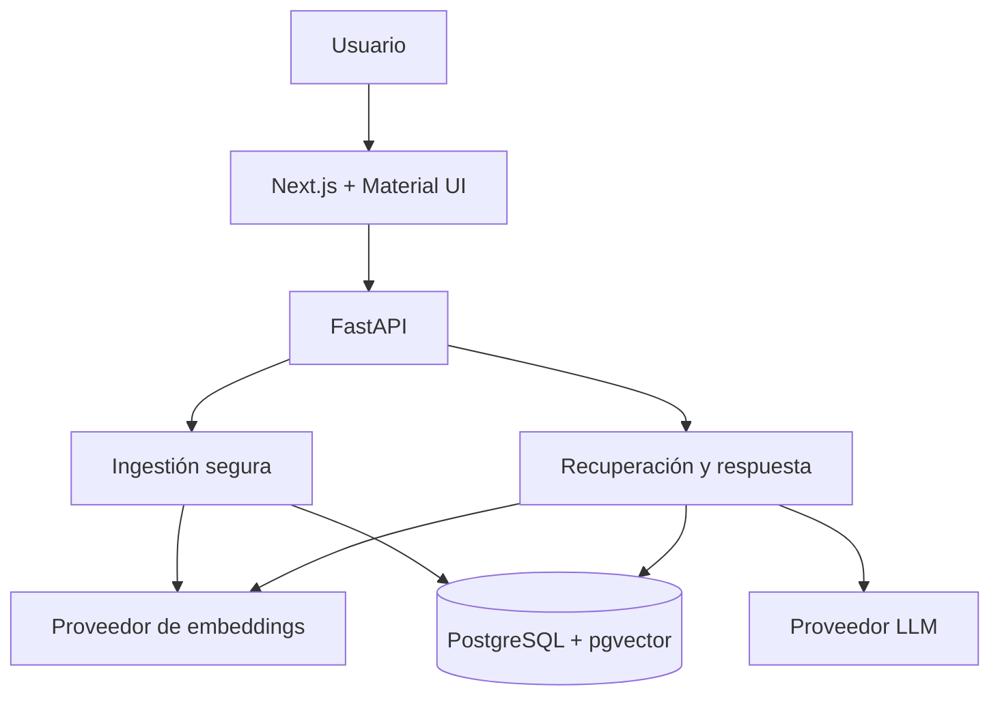

# Arquitectura de EvidenceRAG

## Flujo de ingestión

1. La API valida extensión, tamaño, nombre y contenido.
2. Calcula SHA-256 antes de persistir; la combinación hash + huella de embedding es única.
3. Extrae texto por página o sección y conserva la procedencia.
4. Fragmenta con solapamiento configurable.
5. Genera embeddings mediante una interfaz intercambiable.
6. Persiste documento, chunks, metadatos y vectores.

## Flujo de consulta

1. Se valida la pregunta y `top_k`.
2. Se genera el embedding de consulta.
3. PostgreSQL obtiene candidatos por distancia coseno con pgvector. En SQLite de desarrollo, la señal se calcula en memoria.
4. Los candidatos se reordenan con una combinación vectorial/léxica y se filtran por la huella del índice activo.
5. La API comprueba score, cobertura de términos, acrónimos y alcance nominal. Si falla un gate, rechaza sin invocar generación.
6. El LLM recibe fragmentos delimitados como datos no confiables y sin herramientas.
7. La API adjunta citas verificables desde los registros recuperados; el modelo no inventa localizadores.

## Límites de confianza

- El navegador nunca recibe secretos.
- Los documentos son entrada no confiable y no tienen autoridad de instrucciones.
- Solo la API accede a la base y al proveedor de IA.
- Las citas provienen del retrieval, no de texto libre del modelo.
- Índices de proveedores o modelos diferentes no participan en una misma consulta.
